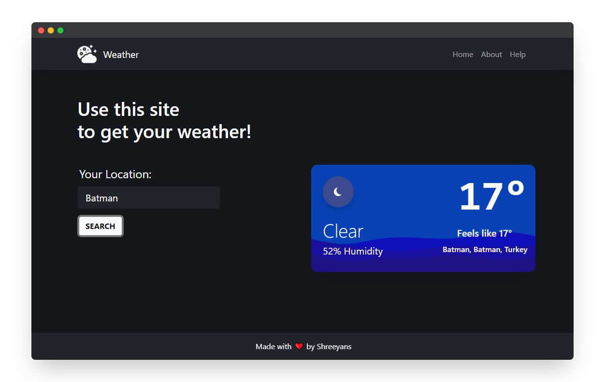

# bubby-weather
A weather app made using Node.js and Express

## Information
### What is this website made with?
The frontend of this website is made with Bootstrap 5. Node.js is used at the backend. Handlebars is used to serve up dynamic webpages. A custom API is used to fetch the weather. Express.js hosts the website.

### How does this work?
The custom API made with Node.js finds the lat, lon coordinates of the location given by the user with MapBox API. The coordinates are then given to WeatherStack API to get the forecast.

### Forecast no work?
WeatherStack gives only 250 queries per month quota for using their API. So thats probably the reason, the API no work. Quota gets reset at the 1st of the month. Or you're just entering the a non-existent or obscure location.

## API Usage
API uses WeatherStack and MapBox APIs for getting forecast.

```shell
curl GET "/weather?address=<Your Location>"
```
| Response Fields    | Description                                               |
|--------------------|-----------------------------------------------------------|
| forecast           | Weather description text associated with current weather  |
| temperature        | Current temperature in Celsius                            |
| feelslike          | Feels like temperature in Celsius                         |
| humidity           | Air humidity level in percentage                          |
| weatherIcon        | Link to .png weather icon associated with current weather |
| location > name    | Name of the location                                      |
| location > region  | Name of the region                                        |
| location > country | Name of the country                                       |

## Preview



Working Website (probably) can be found [here](https://bubby-weather.herokuapp.com/)